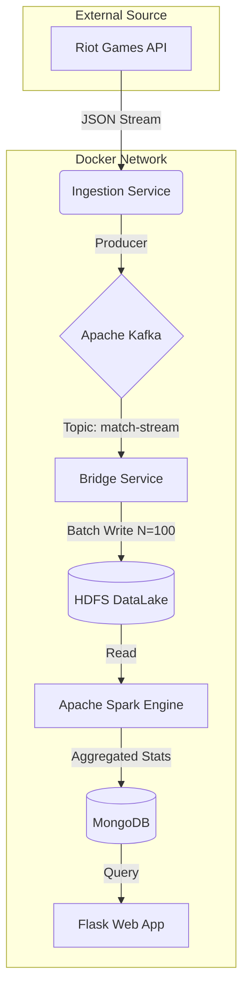

# TFT Metagame Analytics Pipeline 

> **Distributed Big Data Architecture for Real-Time Competitive Gaming Strategy**


##  Overview

The **TFT Metagame Analytics Pipeline** is an end-to-end Big Data system designed to solve the stochastic optimization problem of *Teamfight Tactics* (TFT). By ingesting high-velocity match telemetry from the Riot Games API, this system utilizes a distributed Lambda Architecture to calculate statistically optimal unit compositions ("The Meta") and localized synergy deltas.

Unlike static tier lists, this system processes raw data in real-time, offering granular insights into **Item Optimization**, **Unit Pairing Efficiency**, and **Star-Level Scaling**.

###  Key Features
* **Anti-Rate-Limit Ingestion:** Token-bucket rotation algorithm handling 100+ req/s.
* **Lambda Architecture Bridge:** Custom batch-layer buffering to mitigate HDFS small-file problems.
* **Distributed Aggregation:** PySpark engine tuned for skewed data distributions (8-way explode).
* **Decision Support System (DSS):** Interactive Flask dashboard with fuzzy-asset mapping.

---

##  System Architecture

The project is built on a vertical microservices topology orchestrated via Docker Compose.



> **[Read the Full Architecture Documentation](docs/ARCHITECTURE.md)** for detailed specs on partitions, memory tuning, and data models.

---

##  Project Structure

```text
tft-analytics/
├── docker-compose.yml          # Root orchestrator for all 6 services
├── .env                        # API Keys and Cluster Configs
├── docs/                       # Documentation
│   ├── ARCHITECTURE.md         # Technical Deep Dive
│   └── SETUP.md                # Installation Guide
├── ingestion/                  # [Layer 1] Riot API -> Kafka Producer
├── bridge/                     # [Layer 2] Kafka -> HDFS Batcher
├── processing/                 # [Layer 3] Spark ETL & Math Logic
└── web_app/                    # [Layer 4] Flask Decision Support System
```

---

##  Quick Start

For detailed instructions, see the **[Setup Guide](docs/SETUP.md)**.

1.  **Clone the Repo**
    ```bash
    git clone [https://github.com/yourusername/tft-analytics.git](https://github.com/yourusername/tft-analytics.git)
    cd tft-analytics
    ```

2.  **Add API Key**
    Create a `.env` file:
    ```bash
    RIOT_API_KEY=RGAPI-xxxxxxxx-your-key-here
    ```

3.  **Launch Cluster**
    ```bash
    docker-compose up -d --build
    ```

4.  **Access Services**
    * **Dashboard:** [http://localhost:5000](http://localhost:5000)
    * **HDFS UI:** [http://localhost:9870](http://localhost:9870)
    * **Spark Master:** [http://localhost:8080](http://localhost:8080)

---

##  Tech Stack

| Component | Technology | Role |
| :--- | :--- | :--- |
| **Ingestion** | Python 3.9, Requests | High-latency API polling & Key Rotation |
| **Streaming** | Apache Kafka 7.0 | Asynchronous message buffering |
| **Storage** | Hadoop HDFS 3.2 | Raw immutable data lake (JSON) |
| **Compute** | Apache Spark 3.3 | Distributed aggregation & Shuffle |
| **Database** | MongoDB 5.0 | Document store for hierarchical Meta archetypes |
| **Frontend** | Flask, Jinja2 | User Interface & fuzzy asset search |

##  License

Distributed under the MIT License. See `LICENSE` for more information.

---
*Disclaimer: This project is not endorsed by Riot Games and does not reflect the views or opinions of Riot Games or anyone officially involved in producing or managing Riot Games properties.*
